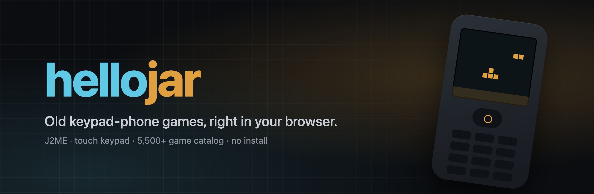
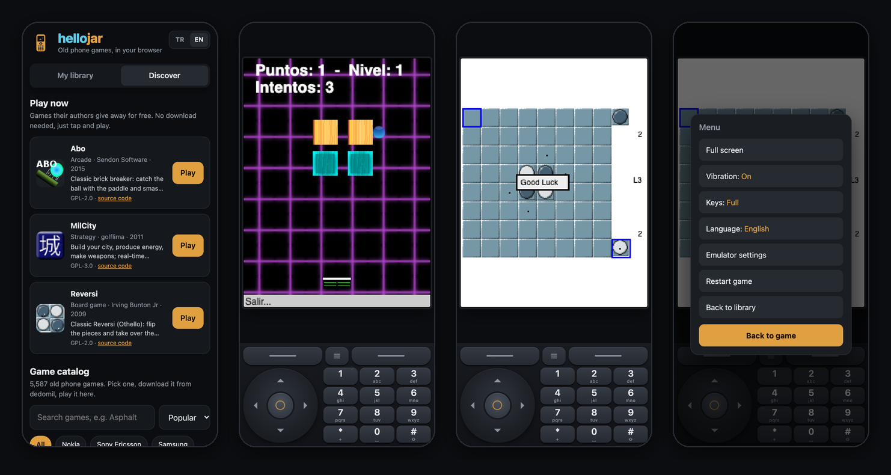

<p align="center">
  <a href="https://hellojar.netlify.app"></a>
</p>

<p align="center">
  <a href="https://hellojar.netlify.app"><b>▶ Hemen oyna</b></a>
  &nbsp;·&nbsp;
  <a href="#özellikler">Özellikler</a>
  &nbsp;·&nbsp;
  <a href="#nasıl-çalışıyor">Nasıl çalışıyor</a>
  &nbsp;·&nbsp;
  <a href="#kendin-çalıştır">Kendin çalıştır</a>
  &nbsp;·&nbsp;
  <a href="README.md">🇬🇧 English</a>
</p>

<p align="center">
  <a href="https://hellojar.netlify.app"></a>
  
  
  <a href="LICENSE-freej2me"></a>
</p>

---

Nokia'da yön tuşuyla oynadığın **Yılan**, **Asphalt**, **LOST**'u hatırlıyor musun? **hellojar** o Java ME (J2ME) oyunlarını her modern tarayıcıda, başparmak için tasarlanmış bir tuş takımıyla oynatır. Kurulacak bir şey yok: siteyi aç, oyunu seç, oyna.

<p align="center">
  
</p>

## Özellikler

- **📱 Telefonun içinde telefon.** N80 tarzı 5 yönlü tuş, seçim tuşları ve 0–9 / * / # tuşları var. Parmağını tuştan tuşa kaydırabilir, aynı anda birden fazla tuşa basabilirsin; Android'de her basışta titreşim var. Dikeyde tuşlar ekranın altında, yatayda iki yanda duruyor.
- **🗂 Gerçek bir kütüphane.** İstediğin `.jar` dosyasını (ya da içinde jar olan bir `.zip`'i) ekleyebilirsin. Ekran boyutu ve tuş düzeni dosyadan tahmin ediliyor (`LOST_NokiaN80` → 352×416, `K800i` → 240×320 Sony Ericsson…). Oyunlar ve kayıtlar cihazında kalıyor.
- **▶ Tek dokunuşla 1.300+ oyun.** [Internet Archive](https://archive.org)'da korunan oyunlar doğrudan tarayıcına yüklenir: indirme, reklam, dosya seçme yok. Ekran boyutu dosyadan, manifestten ya da arşivin açıklamasından alınır; oyun menüsünden değiştirilebilir.
- **🔎 5.800+ oyunluk katalog.** Türkçe karakterler fark etmeden arama, marka filtresi, popülerlik/tarih/isim sıralaması var. Arşivde olmayan oyunlarda hellojar, ekranına en uygun çözünürlüğün dedomil indirme sayfasını açıyor; indirdiğin dosya doğrudan kütüphanene ekleniyor.
- **▶ Tek dokunuşla oyunlar.** GPL lisanslı birkaç oyun (Abo, MilCity, Reversi) sitenin içinde geliyor, anında açılıyor.
- **⚡ Donmayı önleyen yama.** Pek çok J2ME oyunu meşgul bekleme yapıyor ya da `while (true)` döngülerinde dönüyor. Telefonda sorun değildi, ama tarayıcı sekmesini donduruyor. hellojar bu oyunların kodunu yüklenirken yamalıyor ([aşağıda](#nasıl-çalışıyor)).
- **🌍 Türkçe / English.** Sağ üstten ya da oyun menüsünden dil değiştirilebiliyor; seçim hatırlanıyor.
- **📲 Uygulama gibi.** Ana ekrana eklenince tam ekran açılıyor. Android'de indirilen jar, *Paylaş → hellojar* ile doğrudan açılıyor.

## Nasıl çalışıyor

```
 .jar dosyan ──► zip.js (açma) ──► freej2me-web (Java; CheerpJ ile JS/Wasm'a derlenmiş)
                                        │
                     MIDletLoader oyun kodunu ASM ile yeniden yazar:
                       Thread.yield()/sleep(0) ─► ThreadCompat (en az 1 ms uyku)
                       her döngü dönüşü        ─► ThreadCompat.loop()
                                        │
             canvas + WebAudio (MIDI) ◄─┴─► dokunmatik tuş takımı (play.js)
```

- **Emülatör:** [freej2me-web](https://github.com/zb3/freej2me-web) (FreeJ2ME; [CheerpJ](https://cheerpj.com/) ile tarayıcıda çalışıyor).
- **Oyunlar neden takılıyor ya da donuyordu:** CheerpJ tüm Java iş parçacıklarını tarayıcının tek iş parçacığında sırayla çalıştırıyor. Gameloft'un ses iş parçacığı `Thread.yield()` içinde dönüp işlemcinin ~%100'ünü yiyordu (LOST ~1 fps'e düşmüştü). Ana döngüsü hiç durmayan oyunlar ise sekmeyi tamamen donduruyordu.
- **Çözüm** [`emulator/src`](emulator/src/org/recompile/mobile) içinde. `yield` ve sıfır süreli `sleep` çağrıları 1 ms'lik uykuya dönüşüyor. Her döngü `ThreadCompat.loop()`'a uğruyor; bir oyun 25 ms aralıksız çalışırsa tarayıcıya sıra veriliyor. Sonuç: LOST ~1'den 14 fps'e çıktı (oyunun kendi sınırı), işlemci kullanımı %100'den ~%15'e indi.
- **Tek dokunuşla oynama:** [`tools/crawl_archive.py`](tools/crawl_archive.py), Internet Archive'daki J2ME jar'larını listeler. archive.org zip *içindeki* dosyaları CORS izniyle sunduğu için jar, oyuncunun tarayıcısına doğrudan archive.org'dan iner; hellojar'dan hiçbir dosya geçmez.
- **Katalog:** [`tools/crawl_dedomil.py`](tools/crawl_dedomil.py), [dedomil.net](http://dedomil.net)'in herkese açık listelerinden oyun adları, üreticiler, çözünürlükler ve 112 px WebP görsellerle küçük bir dizin oluşturuyor (yetişkin içerikler çıkarılıyor). hellojar oyun dosyası barındırmıyor ve aktarmıyor; indirme dedomil'in kendi sayfasında yapılıyor.

## Kendin çalıştır

```bash
git clone https://github.com/yunusemreyildiz/hellojar.git
cd hellojar
npm install
npm start            # → http://localhost:8080
```

Statik bir site: `public/` klasörünü HTTP `Range` isteklerini destekleyen herhangi bir yerde yayınlayabilirsin (Netlify, nginx, Cloudflare Pages, GitHub Pages…). [`netlify.toml`](netlify.toml) hazır.

| İş | Komut |
| --- | --- |
| `emulator/src` değişince emülatör jar'ını yeniden derle (JDK gerekir) | `./tools/build_emulator.sh` |
| `catalog/games.json`'dan tek dokunuşluk oyunları yeniden üret | `python3 tools/build_catalog.py` |
| Dedomil kataloğunu güncelle (kaldığı yerden devam eder) | `python3 tools/crawl_dedomil.py` |
| Internet Archive oyunlarını güncelle ve birleştir | `python3 tools/crawl_archive.py && python3 tools/crawl_dedomil.py --build-only` |
| Oyunları *Popüler*'in en üstüne sabitle | `catalog/dedomil-featured.json`'u düzenle, sonra `python3 tools/crawl_dedomil.py --build-only` |

<details>
<summary><b>Proje yapısı</b></summary>

| Yol | Ne |
| --- | --- |
| `public/index.html`, `src/library.js`, `src/directory.js` | Kütüphane, Keşfet ve katalog |
| `public/play.html`, `src/play.js` | Oynatıcı (`play.html?app=<id>`) |
| `public/src/emu.js` | Java tarafıyla konuşur: inceleme, kurma, ayarlar |
| `public/src/detect.js` | Dosya adından ekran boyutu ve telefon tipi tahmini |
| `public/src/i18n.js` | Türkçe / İngilizce metinler |
| `public/src/zip.js` | `.zip` içindeki `.jar`'ı tarayıcıda çıkarır |
| `public/sw.js`, `manifest.webmanifest` | PWA ve Android paylaş hedefi |
| `emulator/` | freej2me-web'e yaptığımız değişiklikler |
| `catalog/` | Tek dokunuşluk oyunlar (lisanslarıyla) ve katalog ayarları |
| `tools/` | Derleme ve tarama betikleri |

</details>

## Notlar

- **Uyumluluk:** 2D MIDP oyunlarının çoğu sorunsuz çalışır. Bazı 3D (M3G / Mascot Capsule) ve üreticiye özel oyunlar çalışmayabilir; Symbian `.sis` dosyaları hiç çalışmaz.
- **İnternet:** CheerpJ çalışma zamanı kendi CDN'inden yüklendiği için internet gerekir. CheerpJ kişisel ve ticari olmayan kullanımda ücretsizdir.
- **iPhone'da ses:** iOS, sessiz modu anahtarı açıkken Web Audio sesini kapatır.
- **Haklar:** Oyunlar yazarlarına ve yayıncılarına aittir. hellojar yalnızca lisansı izin veren oyunları barındırır ([`catalog/free`](catalog/free/README.md)); dedomil.net ile bağlantılı değildir.

## Teşekkürler

zb3'ün [freej2me-web](https://github.com/zb3/freej2me-web)'i (GPL-3.0) · [FreeJ2ME](https://github.com/hex007/freej2me) · Leaning Technologies'in [CheerpJ](https://cheerpj.com/)'si · J2ME dönemini yaşattıkları için [dedomil.net](http://dedomil.net) ve [Internet Archive](https://archive.org) · Abo, MilCity ve Reversi'nin yazarları (GPL).

<p align="center"><sub><a href="https://yunolabz.xyz">YunoLabz</a> yapımı · <a href="https://hellojar.netlify.app"><b>hello</b>jar</a></sub></p>
